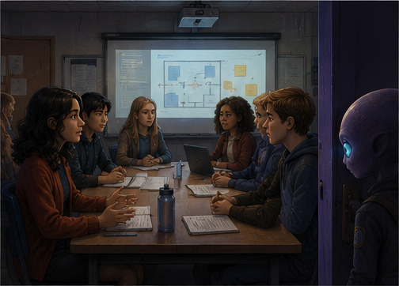
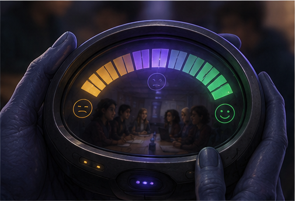

# The Observatory

### A Field Guide for an Alien Learning to Listen

**[🔭 Visit the Observatory → observatory.csmcl.space](https://observatory.csmcl.space)**


---

Zee is an alien. Zee's field is *listening* — not politeness, not letting someone finish a sentence, but the much rarer thing: letting new information have a genuine chance to change what happens next.

Zee has come to study humans, who speak to each other constantly and somehow still manage not to hear one another. Not out of cruelty, usually. Out of momentum, status, embarrassment, tired routine — the ordinary machinery that lets a person be *allowed to speak* while their words are quietly prevented from changing anything.

> What changed because the information was received?

That question is the whole instrument. Every encounter in the Observatory drops you into a familiar human moment — a council meeting, a group chat, an apology — and asks you to respond. Zee doesn't grade you. There's no villain to catch and no verdict to deliver. You watch where the burden moves, whether the room stays open to revision, and what happens two days later because of the choice you made.

## Try it

Open **[observatory.csmcl.space](https://observatory.csmcl.space)** and step into Chapter One, *The Invitation to Speak*. Mara raises a concern in a student council meeting. You choose how the room responds. Watch the field state, follow the consequence, and see what — if anything — changed.

<table>
<tr>
<td width="50%">

<br /><em>Chapter 01 — The Invitation to Speak</em><br />
"Was Mara invited to contribute, or invited to decorate a decision?"
</td>
<td width="50%">

<br /><em>The Receptivity Meter</em><br />
A field instrument that reads how open a room really is — not how polite it sounds.
</td>
</tr>
<tr>
<td width="50%">

<br /><em>Chapter 04 — Seven Pebbles</em><br />
"Everyone inspected the stones. No one looked at the path."
</td>
<td width="50%">

<br /><em>Chapter 16 — The Larger Circle</em><br />
"Listening becomes visible when someone moves a chair."
</td>
</tr>
</table>

## How an encounter works

```
recognizable situation
  → Zee detects a contradiction
  → plausible interpretations coexist
  → the hidden distribution of power/burden becomes visible
  → you respond — not to a verdict, to a question
  → a small, non-magical repair, recognition, or failure follows
  → a field note is left behind
```

Nothing is scored. Nothing is diagnosed. The Observatory watches four things: what your attention noticed, what your response allowed to happen next, where the labor moved, and whether the interpretation stayed revisable.

## The expedition so far

| # | Transmission | Status |
|---|---|---|
| 01 | The Invitation to Speak | **Published** |
| 02 | The Joke With No Owner | In development |
| 03 | The Boundary Debate Society | In development |
| 04 | Seven Pebbles | In development |
| 16 | The Larger Circle | In development |
| — | 11 further transmissions | Charted, unwritten |

Twelve to eighteen stories in total, each independent, each adding to one continuous field guide.

## What this project is *not*

No villains to unmask. No perfect victims. No magical fixes, diagnostic labels, or suspicion training. Zee is a learner, not a judge — and Zee is sometimes, deliberately, wrong. The framework has to be able to correct itself, or it stops being an inquiry and becomes a doctrine.

---

## Running it locally

Built with SvelteKit (`adapter-static`) — no server, just a static build.

```bash
npm install
npm run dev
```

```bash
npm run check   # type-check
npm run build   # writes the static site to build/
npm run preview
```

### Routes

- `/` — introduction
- `/chapter/invitation-to-speak/` — published Chapter One
- `/archive/` — published and upcoming transmissions
- `/prototype/` — preserved single-file reference version

### Adding a chapter

1. Create a typed file in `src/lib/chapters/` following `chapter-01.ts`.
2. Add the complete chapter to `src/lib/chapters/registry.ts` when published.
3. Add its lightweight card to `src/lib/chapters/manifest.ts`.
4. Place its artwork in `static/images/`.
5. Run `npm run check && npm run build` — published registry slugs are automatically prerendered.

Create a new component only when a chapter introduces a genuinely new interactive instrument — the shared shell stays the same; the story is what grows.
